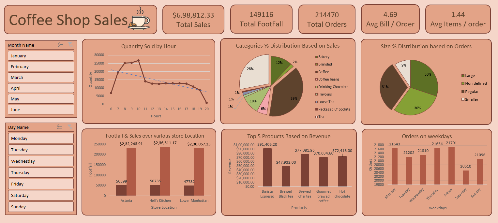

# Coffee Shop Sales Dashboard

## Project Overview

This project analyzes coffee shop sales data using Microsoft Excel to identify sales trends, customer purchasing behavior, product performance, and store performance.

The dashboard provides interactive insights that help answer important business questions related to revenue, orders, customer footfall, product sales, and store operations.

---

## Dashboard Preview

---

## Business Questions

This dashboard answers the following business questions:

1. How do sales vary by day of the week and hour of the day?
2. Are there any peak times for sales activity?
3. What is the total sales revenue for each month?
4. How do sales vary across different store locations?
5. What is the average bill per order?
6. Which products are the best-selling in terms of quantity and revenue?
7. How do sales vary by product category and product type?

## Dashboard Features

### Sales Analysis
- Total sales tracking
- Sales distribution by product category
- Revenue analysis by product

### Customer Analysis
- Total customer footfall
- Average bill per order
- Average items purchased per order

### Product Analysis
- Top revenue-generating products
- Category-wise sales distribution

### Time Analysis
- Orders by weekday
- Sales activity by hour
- Monthly filtering using slicers

### Store Performance Analysis
- Revenue by store location
- Footfall by store location

### Interactive Filters
- Month filter
- Day filter

---

## Tools Used

- Microsoft Excel
- Pivot Tables
- Pivot Charts
- Power Pivot
- Slicers
- Dashboard Design

---

## Key Insights

- Coffee products contribute the largest share of overall sales revenue.
- Morning hours generate the highest sales activity and customer traffic.
- Thursday and Friday record the highest number of orders.
- Barista Espresso is the highest revenue-generating product.
- Astoria store generates the highest revenue among all store locations.
- Customer purchasing behavior remains relatively consistent across the observed period.

---

## Business Recommendations

- Increase staffing during peak morning hours to reduce waiting time.
- Maintain sufficient inventory for top-selling products.
- Promote high-revenue products through bundles and special offers.
- Introduce promotional campaigns on lower-performing weekdays.
- Analyze successful practices at top-performing locations and apply them to other stores.
- Monitor product categories with low sales and evaluate pricing or marketing strategies.

---

## Skills Demonstrated

- Data Cleaning
- Data Analysis
- Business KPI Analysis
- Pivot Tables
- Pivot Charts
- Dashboard Development
- Data Visualization
- Business Insights Generation
- Excel Reporting

---

## Files Included

- Coffee Shop Sales.xlsx
- Dashboard.png
- README.md

